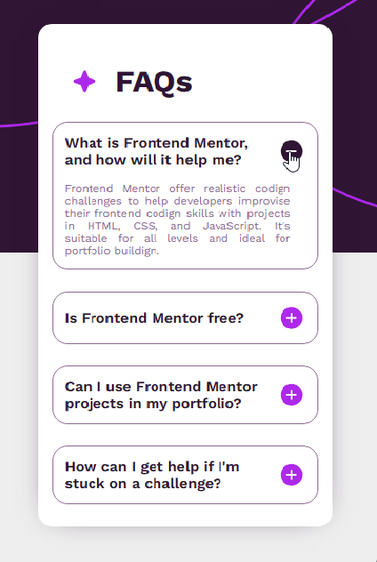
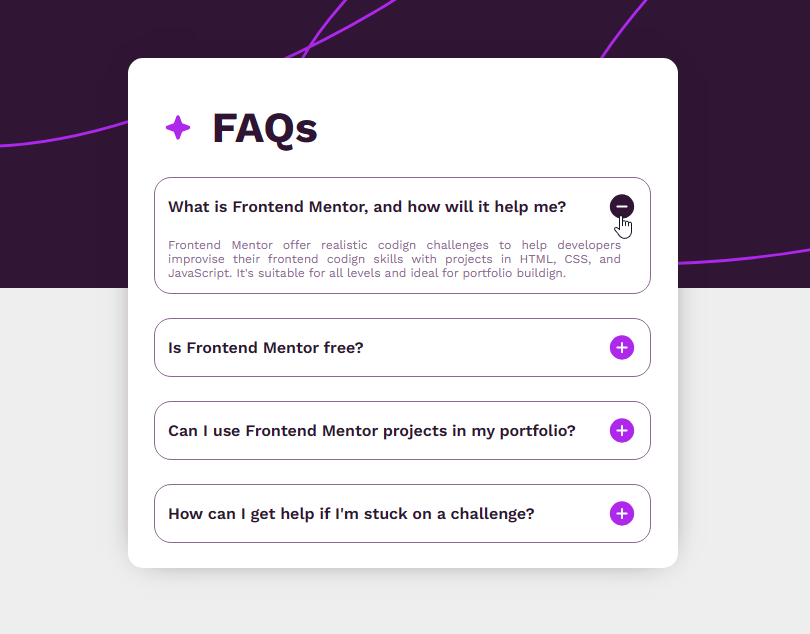

<div align='center'>
 <h1>Title Project</h1>
  
 <p>  </p>
 <p>  </p>
<p align='justify'>
 Lorem ipsum dolor sit amet consectetur, adipisicing elit. Expedita autem culpa aperiam unde quasi quidem consequatur nihil impedit delectus blanditiis tempora beatae, vel sapiente, saepe  quod quaerat soluta enim repellat Lorem ipsum dolor sit amet consectetur, adipisicing elit. Expedita autem culpa aperiam unde quasi quidem consequatur nihil impedit delectus blanditiis  tempora beatae, vel sapiente, saepe quod quaerat soluta enim repellat.
</p>

</div>

## Built With
For these projects, the following tools, frameworks/library, and development environments were used:

| <h3>Lenguajes<h3> | <h3>IDE<h3> | <h3>Frameworks & Library<h3> | <h3>Database<h3> | <h3>Design & Cloud<h3> |
| --------- | --------- | --------- | --------- | --------- |
|    |    |    |    |    |
|    | Valor 7   |    | Valor 9   | Valor 10  |
|   | Valor 12  |   | Valor 14  | Valor 15  |
|   | Valor 17  |   | Valor 19  | Valor 20  |
| Valor 21  | Valor 22  |   | Valor 24  | Valor 25  |
| Valor 26  | Valor 27  |   | Valor 29  | Valor 30  |
| Valor 31  | Valor 32  |    | Valor 34  | Valor 35  |
| Valor 36  | Valor 37  |   | Valor 39  | Valor 40  |
| Valor 41  | Valor 42  |   | Valor 44  | Valor 45  |
| Valor 46  | Valor 47  | Valor 48  | Valor 49  | Valor 50  |


### 👩‍💻 Languages
- 
- 
- 
- 
- 
- 
- 
- 
  
### 👩‍💻 IDE
- 
- 
-                

### 🚀 Frameworks & Library
- 
- 
- 
- 
-  
- 
- 
- 
- 
- 
- 
- 
- 
-          

### 🖍 Design
-        

### ☁ Cloud
- 

### ⚡ Database
- 
-     

### 📚 Education 
- 
- 

###  ❤ Funding 
- 

### 🤜 Group
- 
- 
-      

### 🧐 Linters 
- 
- 

### 👨‍💻 Office
-  
-  
-   

### 💻 OS
- 

### 👨 Social
-  
-  
-  
-  
-  
-  
-  
-  
-  

## Responsive Design (mobile & tablet)
These are the project's designs optimized for both mobile and tablet viewing, complying with different screen resolutions and maintaining a consistent user experience across different screen sizes.
<div align="center">
  
   
</div>

## Getting Started
### Prerequisites 
You must meet certain requirements, you must first have a `node.js`.
* Install `npm`. 
  ```sh
   npm install npm@latest -g
   ```
* Install `vite`.
  ```sh
   npm install -g vite
   ```
### Installation
- To deploy your application on-premises, you must follow the steps below.
* Clone the repo
  ```sh
   git clone https://github.com/your_username_/Project-Name.git
   ```
* Install NPM packages
  ```sh
   npm install
   ```
* View the app
  ```sh
  // mode development
   npm run dev
  // final mode
   npm run start
   ```

## APIs Provided
These client-provided APIs were used for the project.
1. Coffee Api: [name-Api](https://example.com)
2. Coffee2 Api: [name-Api2](https://example.com)


## Contact

Your Name - [[@your_Instagram](https://twitter.com/your_username)] -  [[@your_LinkedIn](https://twitter.com/your_username)]

Project Link: [https://github.com/your_username/repo_name](https://github.com/your_username/repo_name)


